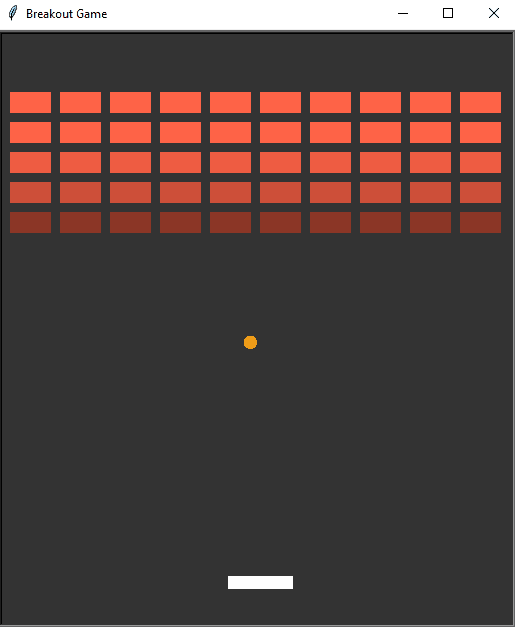

# Breakout
The Breakout Game in Python using the Turtle module

### Written in python 3.10, will work with anything above 3.8

## Installation on Windows:
* `git clone https://github.com/snehangsude/Breakout.git`
* `cd Breakout`
* `python main.py`

## Installation on Linux and Unix like OS:
* `git clone https://github.com/snehangsude/Breakout.git`
* `cd Breakout`
* `python3 main.py`

## Interface and Gameplay

## How to Run

* Run the application using the Installation section
* Use the Arrow keys : ⬅ (Left) (Right) ➡ to move the paddle
* Enjoy the game

## Improvements and Bug Fixes
* Game doesn't end once all the blocks have been elimated. Manual action of exiting is needed.
